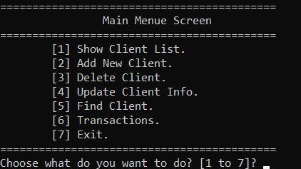

# Bank Management System - Transactions Edition 🏦💳

An extended CLI-based Bank Management Application built in C++. This version introduces a multi-menu architecture featuring full client record management alongside a dedicated Financial Transactions module.

## 🌟 Key Features / الميزات الرئيسية

### 1. Core Account Operations (CRUD)
* **Client Management:** Add new clients with duplicate account detection, update details, search, and delete records.
* **Formatted Tabular Output:** Display structured tables for all active clients.

### 2. Financial Transactions Module 💸
* **Deposit:** Add funds directly to any valid client balance.
* **Safe Withdraw:** Withdraw funds with built-in validation preventing overdrawing beyond available account balance.
* **Total Balances Summary:** Calculate and render a summary view of all client balances along with the total bank reserve.

### 3. Architecture & Data Integrity
* **Single File Persistence:** All operations read and persist changes dynamically to a single text file (`Clients.txt`).
* **Interactive Navigation:** Multi-level terminal menus with dynamic screen refreshes.

---

## 📸 Preview / معاينة التطبيق

---

## 🚀 How to run the project / طريقة التشغيل

1. Clone or download the repository to your machine.
2. Open the solution file (`.sln` or `.slnx`) in **Visual Studio**.
3. Compile and run by pressing **F5**.
